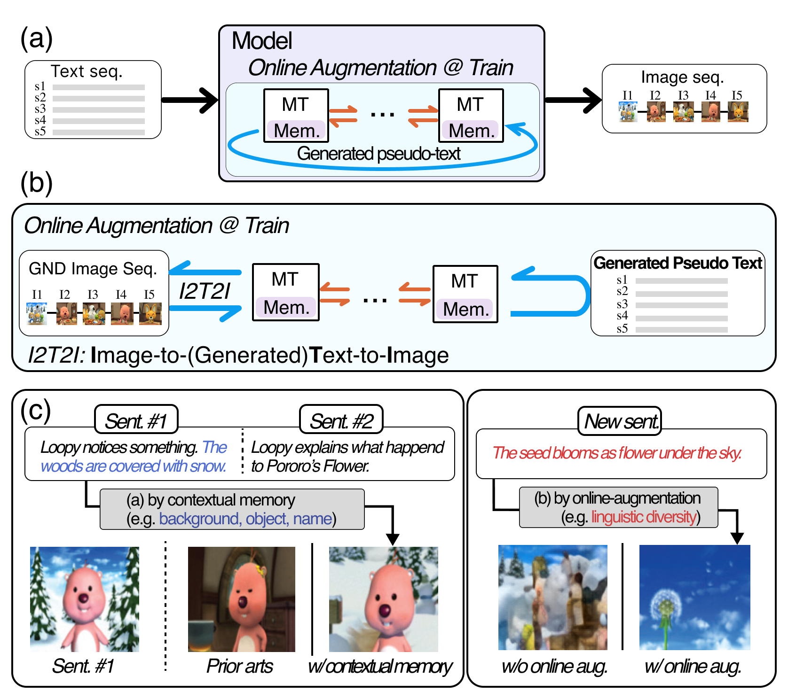

# The Official PyTorch Implementation of CMOTA (Context Memory with Online Text Augmentation)

This is the official implementation of CMOTA ([ICCV 2023](https://iccv2023.thecvf.com)). <br>
[Story Visualization by Online Text Augmentation with Context Memory](https://dcahn12.github.io/projects/CMOTA/) <br>
[Daechul Ahn](https://dcahn12.github.io), [Daneul Kim](https://carpedkm.github.io), [Gwangmo Song](), [SeungHwan Kim](https://kr.linkedin.com/in/seung-hwan-kim-72464680/en), [Dongyeop Kang](https://dykang.github.io), [Jonghyun Choi](https://ppolon.github.io) <br>

Story visualization (SV) is a challenging task that involves generating images from text descriptions while maintaining long-term context across multiple sentences. Previous approaches mainly focused on generating semantically relevant images for individual sentences, but generating contextually convincing images within a given paragraph, such as accurately depicting characters and scene backgrounds, remained a challenge. To address this, we introduce a novel memory architecture for Bi-directional Transformers along with online text augmentation. This augmentation generates multiple pseudo-descriptions to provide additional supervision during training, enhancing the model's ability to generalize to language variations during inference. We refer to our model as CMOTA, which stands for <b>C</b>ontext <b>M</b>emory and <b>O</b>nline <b>T</b>ext <b>A</b>ugmentation.

<p style="text-align: center;">
 <br>
<b>Context encoding by 'Context Memory' and Robust to liguistic diversity by 'Online Text-Augmentation'</b> <br>
</p>

---
## Setup
This repository is implemented base on PyTorch. <br>
Recommend to use Docker ([dcahn/cmota_iccv:latest](https://hub.docker.com/repository/docker/dcahn/cmota_iccv/general)). <br>

### Get the code and install necessary packages
- Clone this repo with git and install required packages. <br>
**Note**: If you use the provided Docker environment, it mauy not necessarily install the required packages. <br>
```bash
$ git clone https://github.com/yonseivnl/cmota.git
$ pip install -r requirements.txt
```

## Data Preparation
### Download data, pretrained model checkpoint
You can download the training dataset and pretraeind checkpoint, ie, [proro dataset]() and [flintstone]() and [pretrained vae checkpoint](https://drive.google.com/file/d/1fugkyU8-tKKHQPr7NALliCjrdT9vJj5y/view?usp=share_link) and [pretraeind memory transformer](https://drive.google.com/file/d/1KNbtw3Qe_rWzyWaB1vvA7jh2-hOKIHZN/view?usp=share_link), respectively. <br>

Then, place the files as follows:
```bash
├── dataset
│   ├── vae_dataset
│   │   ├── pororo
│   │   │    ├── training_dataset
│   │   │    ├── validation_dataset
│   │   │    └── test_dataset
│   │   └── flintstones
│   │        ├── training_dataset
│   │        ├── validation_dataset
│   │        └── test_dataset 
│   └── dalle_dataset
│       ├── pororo
│       └── flintstones
├── pretrained
│   ├── cmota_vae_trained_200.ckpt
│   └── cmota_trained_200.ckpt
│  :
```
**Note**: For vae training, place any image dataset with ImageNet-style directory structure (at least 1 subfolder) to fit the dataset into pytorch ImageFolder.

## Train and Inference CMOTA
### Training VQVAEs
```bash
$ bash scripts/train_vae.sh
```

### Training memory transformer
**Note**: For training memory transformer, place the pretrained vae model in the correct folder or modify the config file path.
```bash
$ bash scripts/train_memory_transformer.sh
```

### Generating paragraph to image sequence
```bash
$ scripts/infer_images_generation.sh
```


## BibTeX
```
@inproceedings{ahnKSKLKC23,
author    = {Daechul Ahn and Daneul Kim and Gwangmo Song and Seung Hwan Kim and Honglak Lee and Dongyeop Kang and Jonghyun Choi}
title     = {Story Visualization by Online Text Augmentation with Context Memory}
booktitle = {ICCV}, 
year      = {2023}
}
```

## Acknowledgement
```
This work is partly supported by the NRF grant (No.2022R1A2C4002300) 25%, IITP grants (No.2020-0-01361, AI GS Program (Yonsei University) 5%, No.2021-0-02068, AI Innovation Hub 5%, 2022-0-00077 15%, 2022-0-00113 15%, 2022-0-00959 15%, 2022-0- 00871 10%, 2022-0-00951 10%) funded by the Korea government (MSIT).
```
